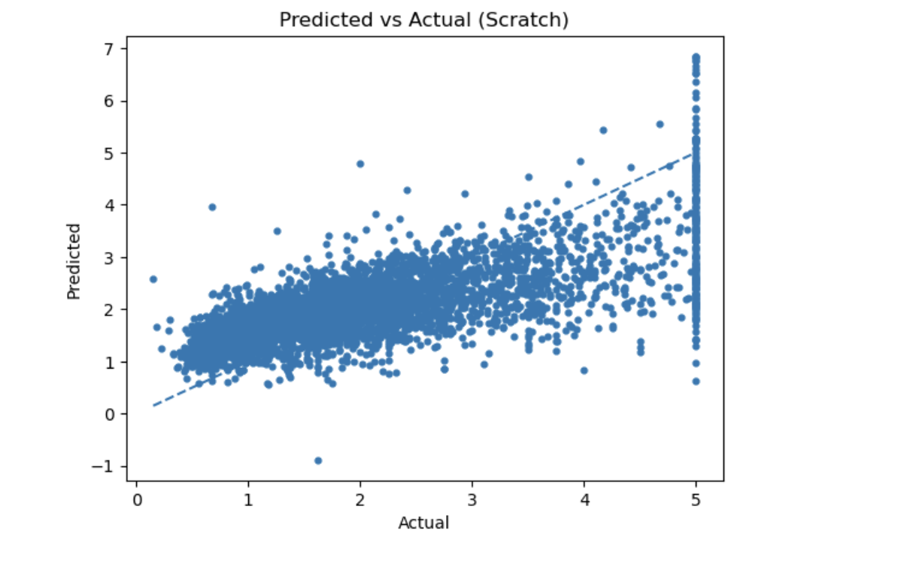
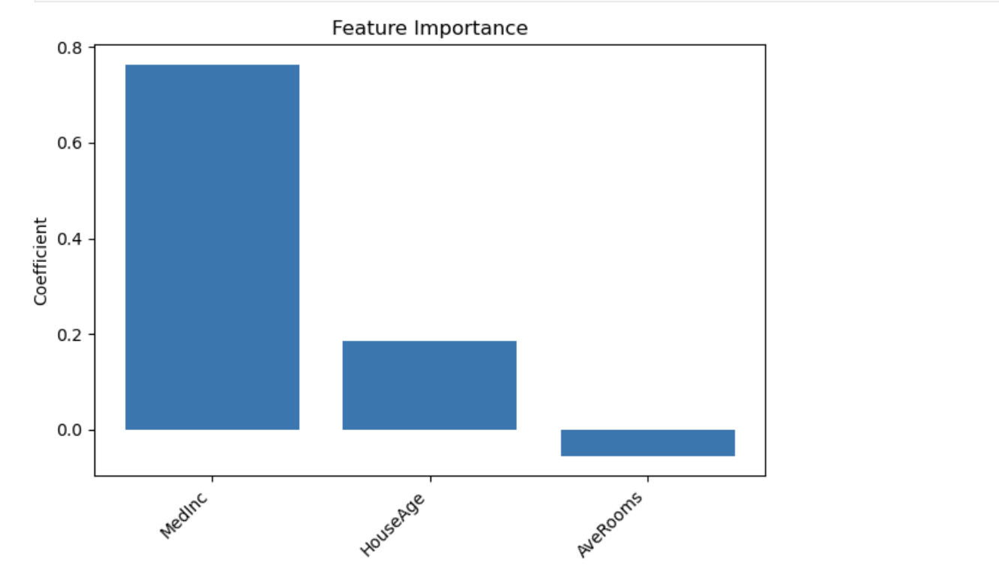
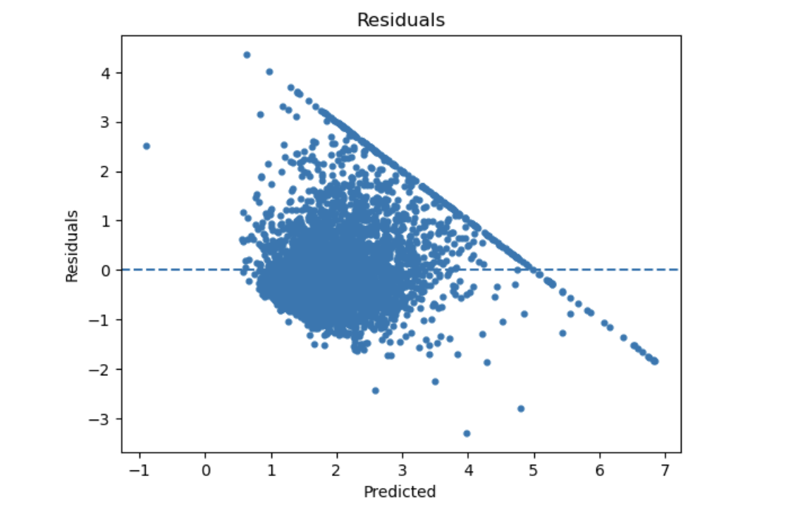

# Linear Regression from Scratch  



---

[](https://www.python.org/)  
[](https://numpy.org/)  
[](LICENSE)  
[](https://jupyter.org/)  

---

## Overview
This project builds **Multivariate Linear Regression from scratch** using only **NumPy**, implementing modern enhancements such as **Ridge (L2) Regularization**, **Early Stopping**, and **visual diagnostics**. It benchmarks performance against scikit-learn's `LinearRegression` and `Ridge`, using the **California Housing** dataset.

The purpose: to deeply understand the mechanics of gradient descent, regularization, and model evaluation — not just use libraries, but *build the fundamentals yourself*.

---

## Table of Contents
- [Key Features](#key-features)
- [Project Structure](#project-structure)
- [Dataset & Preprocessing](#dataset--preprocessing)
- [Installation](#installation)
- [Quick Start](#quick-start)
- [Results & Visualizations](#results--visualizations)
- [Interpretation](#interpretation)
- [Troubleshooting](#troubleshooting)
- [Extensions](#extensions)
- [Contributing](#contributing)
- [License](#license)

---

## Key Features
- **Batch Gradient Descent** with configurable hyperparameters  
- **Ridge (L2) Regularization** for better generalization  
- **Early Stopping** (tolerance + patience)  
- **Standardized Train/Validation/Test Split**  
- **Custom Evaluation Metrics:** MSE, MAE, R²  
- **Visual Diagnostics:**
  - Convergence curves
  - Feature importance bar chart
  - Residuals plot
  - Predicted vs Actual scatter
- **Baselines:** Compare against scikit-learn’s `LinearRegression` and `Ridge`

---

## Project Structure
```
Linear-Regression-Scratch/
├── linear_scratch/
│   ├── __init__.py
│   ├── model.py           # Core model implementation
│   ├── metrics.py         # Custom MSE, MAE, R² functions
│   └── plotting.py        # Visual utilities
│
├── notebooks/
│   ├── Linear_Regression_Scratch.ipynb   # Main workflow
│   └── images/                           # Generated plots
│       ├── feature_importance.png
│       ├── residuals.png
│       └── predicted_vs_actual.png
│
├── requirements.txt
├── LICENSE
└── README.md
```

---

## Dataset & Preprocessing
- **Dataset:** California Housing dataset from `scikit-learn.datasets`  
- **Target:** Median house value (log-scaled)  
- **Preprocessing Steps:**
  - Standardization using z-score scaling
  - Random Train/Validation/Test split (seeded)
  - Ridge penalty tuning and early stopping based on validation loss

This ensures stable gradient updates and mitigates feature magnitude bias.

---

## Installation
```
# Clone the repository
git clone https://github.com/AshBeeXD/Linear-Regression-Scratch.git
cd Linear-Regression-Scratch

# (Optional) Create a virtual environment
python -m venv .venv
source .venv/bin/activate  # macOS/Linux
.venv\Scripts\Activate.ps1 # Windows

# Install dependencies
pip install -r requirements.txt
```

---

## Quick Start
Run the Jupyter notebook to reproduce the full workflow:
```
jupyter notebook notebooks/Linear_Regression_Scratch.ipynb
```
Or import and train directly from Python:
```
from linear_scratch import LinearRegressionScratch
from sklearn.datasets import fetch_california_housing
from sklearn.model_selection import train_test_split
from sklearn.preprocessing import StandardScaler

# Load and prepare data
data = fetch_california_housing()
X_train, X_test, y_train, y_test = train_test_split(data.data, data.target, test_size=0.2, random_state=42)
scaler = StandardScaler()
X_train, X_test = scaler.fit_transform(X_train), scaler.transform(X_test)

# Train custom model
model = LinearRegressionScratch(learning_rate=0.01, n_iters=1000, lambda_reg=0.1, tol=1e-4, patience=10)
model.fit(X_train, y_train, verbose=True)

# Evaluate
print(model.evaluate(X_test, y_test))
```

---

## Results & Visualizations
| Metric | Train (Scratch) | Test (Scratch) | Train (SK Linear) | Test (SK Linear) | Train (SK Ridge) | Test (SK Ridge) |
|:-------|:----------------|:---------------|:------------------|:-----------------|:-----------------|:----------------|
| MSE    | 0.6534 | 0.6625 | 0.6474 | 0.6589 | 0.6474 | 0.6589 |
| MAE    | 0.6070 | 0.6112 | 0.5987 | 0.6033 | 0.5987 | 0.6033 |
| R²     | 0.5112 | 0.4945 | 0.5157 | 0.4972 | 0.5157 | 0.4972 |

**Visuals:**
- **Feature Importance**  
  

- **Residuals Distribution**  
  

- **Predicted vs Actual**  
  

---

## Interpretation
The model reveals **Median Income (MedInc)** as the strongest predictor of housing prices, followed by **House Age** and **Average Rooms**. Ridge regularization ensures that correlated variables (e.g., population and occupancy) don’t dominate the model.

Early stopping provides convergence efficiency — halting training once validation loss stabilizes.

---

## Troubleshooting
| Issue | Possible Cause | Fix |
|:------|:----------------|:----|
| Diverging loss | Too high learning rate | Lower `learning_rate` (e.g., 0.001) |
| No improvement in validation | Over-regularization | Reduce `lambda_reg` |
| NaN or inf values | Data not standardized | Use `StandardScaler` before training |

---

## Extensions
- Implement **Lasso (L1)** or **Elastic Net** regularization
- Add **learning rate scheduling** or **momentum optimizers**
- Perform **k-fold cross-validation**
- Conduct **hyperparameter sweeps** on `lambda_reg` and `lr`
- Wrap into a **pip-installable package** (`pip install linear-scratch`)

---

## Contributing
Contributions, bug reports, and improvements are welcome!  
Fork the repo, create a feature branch, and submit a pull request.

```
git checkout -b feature/new-feature
git commit -m "Add new feature"
git push origin feature/new-feature
```

---

## License
Released under the **MIT License**. See [LICENSE](LICENSE) for details.
